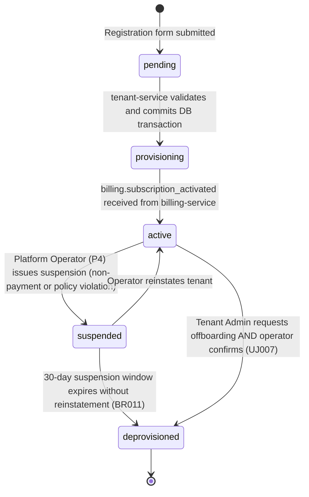
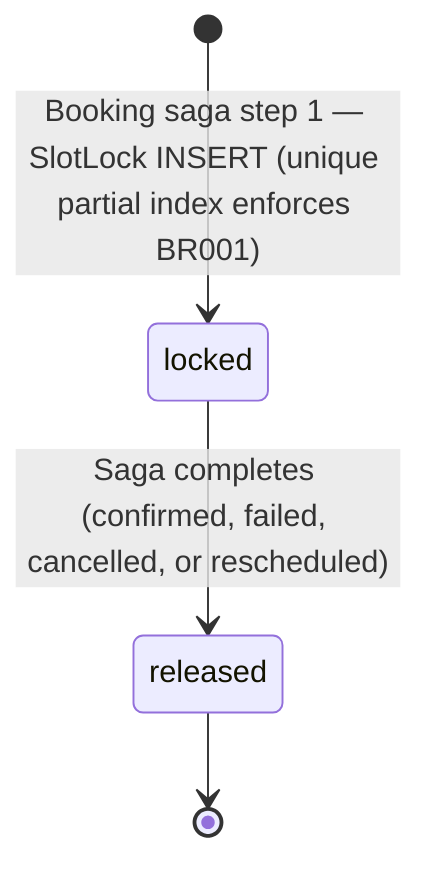
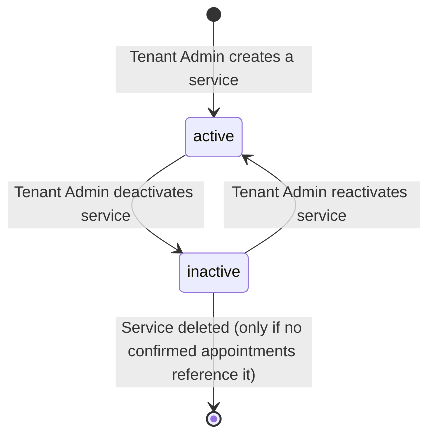
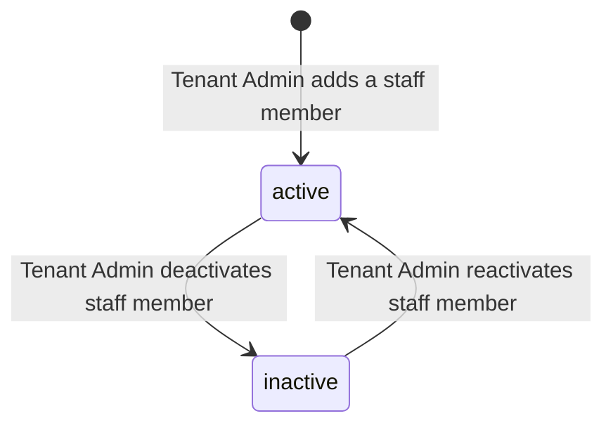

# D4 · State Machines

## Overview

AnjiSchedulo uses Event Sourcing for the `Appointment` aggregate (ADR001) — state is derived by replaying AppointmentEvents, not read from a mutable status column. State machines in this document define the valid transitions for all stateful entities. Each machine shows:

- The full set of valid states
- Every allowed transition with its triggering event or action
- Disallowed transitions (implicit: any transition not listed is rejected)

---

## 1. Tenant State Machine

**Entity:** `Tenant`  
**Owned by:** tenant-service  
**Source:** FR001, BR011



**State Definitions:**

| State | Meaning | Allowed Operations |
|---|---|---|
| `pending` | Registration submitted, DB transaction in progress | None — transition only |
| `provisioning` | Tenant row committed, waiting for billing activation | Read-only tenant lookup |
| `active` | Fully operational; accepts bookings | All CRUD operations, bookings, exports |
| `suspended` | Temporarily blocked due to non-payment or policy violation | Read-only; no new bookings; exports allowed |
| `deprovisioned` | Tenant is permanently closed; data scheduled for deletion | No operations permitted; AuditLog retained permanently |

**Key Business Rules:**
- BR011: Suspension allows 30-day read-only window before deprovisioning.
- Deprovisioning is irreversible. The `deprovisioned_at` timestamp is set and never cleared.
- Booking-command-service checks tenant status before accepting any booking request. A `suspended` or `deprovisioned` tenant receives `403 Forbidden`.

---

## 2. Appointment State Machine

**Entity:** `Appointment` (Event Sourced)  
**Owned by:** booking-command-service  
**Source:** FR004, BR001, BR004, BR009, ADR001

```mermaid
stateDiagram-v2
    [*] --> requested : Customer submits booking request (UJ002 step 1)
    requested --> confirmed : payment.captured received; booking saga completes (BR004)
    requested --> failed : Booking saga compensation fires (slot unavailable, payment failure, timeout)
    confirmed --> rescheduled : Customer or Staff requests reschedule (UJ003)
    confirmed --> cancelled : Customer cancels within cancellation window (UJ004, BR002)
    confirmed --> cancelled : Staff or Admin cancels on behalf of customer
    confirmed --> completed : Appointment datetime passes; system marks completed (scheduled job)
    rescheduled --> confirmed : Rescheduled appointment confirmed (new slot reserved, payment unchanged)
    rescheduled --> cancelled : Customer cancels rescheduled appointment
    cancelled --> [*]
    completed --> [*]
    failed --> [*]
```



**State Definitions (derived from AppointmentEvent stream):**

| Derived State | Determining AppointmentEvent | Description |
|---|---|---|
| `requested` | Latest event = `appointment.requested` | Booking saga started; slot locked; payment not yet captured |
| `confirmed` | Latest event = `appointment.confirmed` | Payment captured; appointment is firm |
| `rescheduled` | Latest event = `appointment.rescheduled` | New slot confirmed; old slot released |
| `cancelled` | Latest event = `appointment.cancelled` | Slot released; refund triggered (if applicable) |
| `completed` | Latest event = `appointment.completed` | Appointment time has passed |
| `failed` | Latest event = `appointment.failed` | Saga compensation ran; slot released; payment refunded or not charged |

**Booking Saga Steps (BR004):**

```
requested
  ├─ [1] Lock slot (SlotLock INSERT)
  ├─ [2] Publish appointment.slot_reserved → payment-service
  ├─ [3] payment.captured received
  │       └─ Publish appointment.confirmed → all consumers
  └─ [compensation]
       ├─ payment.failed OR timeout (2 minutes)
       │       ├─ Release SlotLock
       │       ├─ Publish appointment.failed
       │       └─ State → failed
       └─ slot unavailable (SlotLock unique constraint violated)
               ├─ Return 409 Conflict to client
               └─ State → failed (no SlotLock created)
```

**Cancellation Rules (BR002, BR009):**
- Cancellation is only accepted if `NOW()` is at least `TenantConfig.cancellation_hours` before `slot_start`.
- Late cancellations (within the cancellation window) are rejected with `422 Unprocessable Entity`.
- On cancellation: SlotLock is released and refund is triggered via `appointment.cancelled` event → payment-service.

**Rescheduling (UJ003):**
- Rescheduling creates a new `appointment.rescheduled` event carrying the new `slot_date`, `slot_start`, `slot_end`.
- The old SlotLock is released atomically when the new SlotLock is acquired.
- If the new slot is already taken, rescheduling returns `409 Conflict` and the original appointment remains confirmed.

---

## 3. Payment State Machine

**Entity:** `Payment`  
**Owned by:** payment-service  
**Source:** FR005, BR009, BR012

```mermaid
stateDiagram-v2
    [*] --> pending : payment-service receives appointment.slot_reserved; creates PaymentIntent with Stripe
    pending --> captured : Stripe confirms payment_intent.succeeded webhook
    pending --> failed : Stripe returns payment_intent.payment_failed OR timeout
    captured --> refunded : appointment.cancelled received; Stripe Refund API called successfully (BR009)
    captured --> refund_failed : Stripe Refund API call fails after 4 retries; routes to DLQ
    refunded --> [*]
    refund_failed --> [*] : Manual operator resolution required
    failed --> [*]
```



**State Definitions:**

| State | Description | Next Action |
|---|---|---|
| `pending` | PaymentIntent created in Stripe; awaiting confirmation | Wait for Stripe webhook |
| `captured` | Stripe confirmed payment; `payment.captured` published | None — terminal until cancellation |
| `failed` | Stripe declined; `payment.failed` published → booking saga compensates | Booking saga releases slot; state → failed |
| `refunded` | Stripe refund confirmed; `payment.refunded` published | Terminal |
| `refund_failed` | Stripe refund failed after retries; DLQ entry created | Operator must manually issue refund via Stripe dashboard |

**Key Rule:** A `refund_failed` Payment record persists permanently alongside the cancelled Appointment record. The operator's manual resolution is recorded in AuditLog (BR014).

---

## 4. SlotLock State Machine

**Entity:** `SlotLock`  
**Owned by:** booking-command-service  
**Source:** BR001, BR004



**Unique Partial Index:**
```sql
CREATE UNIQUE INDEX slot_locks_active_unique
  ON slot_locks (tenant_id, staff_id, slot_date, slot_start)
  WHERE released_at IS NULL;
```

**Behaviour:**
- If the INSERT violates the unique index, the slot is already locked → booking saga returns `409 Conflict` immediately.
- `released_at` is set atomically in the same transaction as the outcome event (confirmed, failed, cancelled, rescheduled).
- Only one lock can exist per `(tenant_id, staff_id, slot_date, slot_start)` at any time. Once released, a new lock for the same slot is permitted.

---

## 5. NotificationRecord State Machine

**Entity:** `NotificationRecord`  
**Owned by:** notification-service  
**Source:** FR007, BR007

```mermaid
stateDiagram-v2
    [*] --> pending : notification-service dequeues appointment event from SQS
    pending --> sent : Delivery provider (SendGrid/Twilio) confirms delivery
    pending --> failed : Delivery provider returns error
    failed --> pending : Retry scheduled (exponential backoff; max 4 retries)
    failed --> dlq : 4th retry exhausted; notification.failed event published to ops-service
    sent --> [*]
    dlq --> [*] : Operator resolves manually via ops console
```

**Retry Schedule:**
- Attempt 1: Immediate
- Attempt 2: +1 second
- Attempt 3: +2 seconds
- Attempt 4: +4 seconds
- Attempt 5 (final retry): +8 seconds — if this fails, status → `dlq`

**Key Rule (BR007):** Notification delivery failure must never propagate to the booking saga or block any appointment operation. `dlq` is a terminal notification state; the appointment itself remains `confirmed` or `cancelled` regardless.

---

## 6. ReplayJob State Machine

**Entity:** `ReplayJob`  
**Owned by:** ops-service  
**Source:** FR011, UJ006

```mermaid
stateDiagram-v2
    [*] --> queued : Platform Operator submits replay request via ops console
    queued --> running : ops-service picks up the job and begins reading AppointmentEvents
    running --> completed : All in-scope events published to SNS; events_published count recorded
    running --> failed : Unrecoverable error during replay; error_message populated
    running --> cancelled : Operator manually cancels the in-progress replay
    completed --> [*]
    failed --> [*]
    cancelled --> [*]
```



**Live Isolation:** Replay events enter the same SQS queues as live events. Consumer idempotency (InboxRecord) ensures already-processed events are skipped regardless of whether they arrive from live traffic or replay. Live bookings are unaffected during replay (FR011).

**Rate Limiting:** ops-service publishes at a maximum of 500 replay events/second to avoid consumer overload.

---

## 7. Service (Catalogue Item) State Machine

**Entity:** `Service`  
**Owned by:** tenant-service  
**Source:** FR002



**Key Rules:**
- An `inactive` service is hidden from the public booking page — no new bookings can be made.
- Existing `confirmed` appointments referencing a deactivated service are not affected; they retain a snapshot of the service data in the AppointmentEvent payload.
- Deletion is only allowed if no confirmed appointments reference the service; otherwise, the service can only be `inactive`.

---

## 8. StaffMember State Machine

**Entity:** `StaffMember`  
**Owned by:** tenant-service  
**Source:** FR002, P2



**Key Rules:**
- An `inactive` StaffMember is hidden from the public booking page.
- Deactivation does not cancel existing confirmed appointments — those retain their `staff_id` and service the full appointment lifecycle.
- Availability-service excludes `inactive` staff from slot computation immediately on `tenant.configured` event receipt.

---

## State Machine Cross-Reference

| State Machine | Aggregate / Entity | Mutable Status Column | Event Sourced |
|---|---|---|---|
| Tenant | Tenant | Yes | No |
| Appointment | Appointment | No — derived from AppointmentEvent[] | Yes |
| Payment | Payment | Yes | No |
| SlotLock | SlotLock | Yes (`released_at`) | No |
| NotificationRecord | NotificationRecord | Yes | No |
| ReplayJob | ReplayJob | Yes | No |
| Service | Service | Yes (`active`) | No |
| StaffMember | StaffMember | Yes (`active`) | No |

The Appointment state machine is the only event-sourced state machine in AnjiSchedulo. All other entities maintain a conventional mutable status or flag column. This is a deliberate scope decision — Appointment history is the core audit trail and must be reconstructible from first principles (BR014, ADR001). Other entities have simpler lifecycles with fewer compliance requirements.
