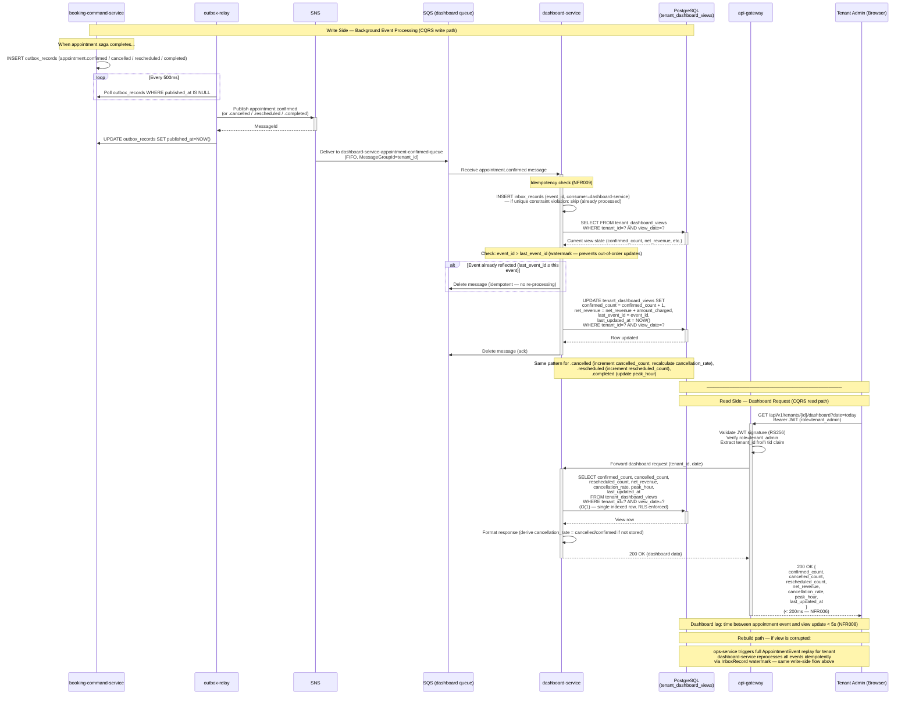

# D3 · Sequence Diagram — UJ005: Tenant Dashboard Review

## Overview

This diagram shows two concurrent flows that make the tenant dashboard work:

1. **Write side (background):** `appointment.*` events arriving from SNS → SQS → dashboard-service, which applies idempotent incremental updates to the `tenant_dashboard_views` materialised view.
2. **Read side (foreground):** The tenant admin opens the dashboard and receives a < 200ms response served directly from the pre-aggregated view — no joins, no real-time computation.

The CQRS pattern separates these two concerns entirely. The read path is always fast; the write path is eventually consistent with a < 5s lag target.

---

---

## Key Design Points

### Why CQRS + Materialised View?

The dashboard serves a radically different access pattern from the booking write side:
- **Write side:** High-volume, concurrent, saga-orchestrated, strongly consistent.
- **Read side:** Low-latency (< 200ms), single-tenant, pre-aggregated, never blocking write operations.

Joining live tables at dashboard query time would not meet the 200ms target under load. A pre-aggregated materialised view, updated incrementally by the event stream, delivers O(1) read performance regardless of appointment volume.

### Idempotency (NFR009)

The `last_event_id` watermark on `tenant_dashboard_views` ensures that:
- If SQS delivers the same event twice, the second update is a no-op (event_id ≤ last_event_id).
- Replay events are safe: they reapply each event once in order, rebuilding the view correctly.

### Lag target

The dashboard reflects booking events within **5 seconds** under normal load (NFR008). This is the sum of: outbox-relay poll interval (≤ 500ms) + SNS → SQS delivery (< 1s) + dashboard-service processing (< 100ms) + DB write (< 100ms).

---

## Key NFRs Satisfied

| NFR | Target | How |
|---|---|---|
| NFR005 | Dashboard < 200ms p95 | O(1) read from pre-aggregated view, no joins |
| NFR006 | Dashboard served from materialized view | tenant_dashboard_views — no write-side join |
| NFR008 | Dashboard lag < 5 seconds | Outbox relay + FIFO SQS + incremental update |
| NFR009 | Idempotent consumer | InboxRecord + last_event_id watermark |
